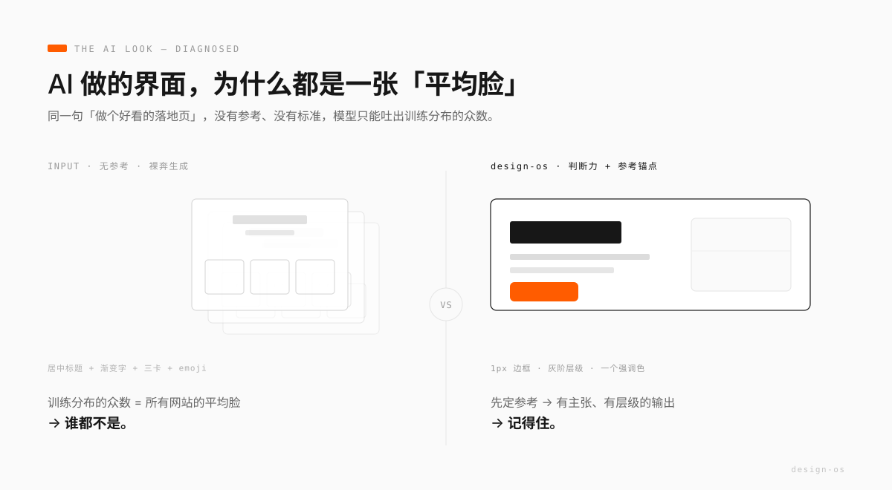
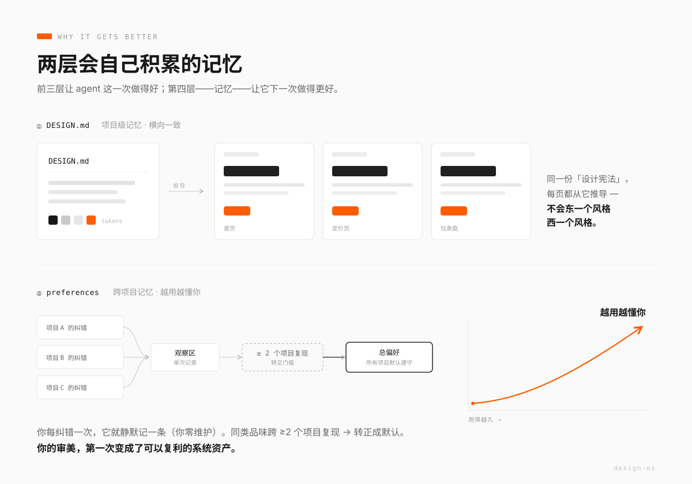

# 用好 design-os：把你的品味，变成 AI 的设计判断力

> 这是一篇讲「怎么用好」的指南。想先装上,看 [DEPLOY.md](DEPLOY.md);想知道它是什么,看 [README.md](README.md)。

## 先说病:AI 做的 UI,为什么永远一股「模板脸」

你大概见过太多这样的界面:居中的大标题、渐变色的字、下面并排三张卡片、每张卡配一个 emoji、文案是「赋能」「一站式」「无缝」。

不是某个模型的问题,是所有模型的**共同默认值**。原因很简单:当你只丢一句「做个好看的落地页」,模型没有任何参考、没有任何标准,它只能吐出训练数据里最高频的那个平均形态。而**平均,就等于谁都不是**——它谁的记忆点都没有,因为它是所有页面的均值。

想让 AI 做出「不像 AI」的东西,靠的不是把 prompt 写得更长、语气更用力。你得给它两样它天生没有的东西:**判断力**,和**参考锚点**。

这就是 design-os 干的事。

## 解法:不逼模型更用力,而是先给它「设计判断力」

design-os 是一套**纯文本、agent 无关**的操作系统(Claude / Codex / Cursor 都能装)。它不是组件库、不绑任何框架,它喂给 agent 的是四层能力:

1. **判别力** —— 一套「什么是好 / 什么是 AI 味」的硬标准和出厂自检,让 agent 自己认得出烂。
2. **见识** —— 一条铁律:先定高质量参考再动手,**禁止无参考裸奔生成**。
3. **手艺** —— 四层配方 + 交互技法卡,知道好效果具体怎么做出来。
4. **记忆** —— 两层「越用越强」的记忆机制,下面详说。

前三层让 agent 这一次做得好;**第四层让它下一次做得更好**。这才是 design-os 真正的杠杆。

## 灵魂:两层记忆,让系统越用越懂你

### 第一层:DESIGN.md —— 项目级记忆(管「这个项目内部一致」)

新项目起步时,agent 不会直接动手。它先陪你走一遍:问清你要表达什么、给谁看、有没有参考、有没有「绝对不要」;然后从参考库给你 **3 个风格候选**让你挑;挑定之后,把整个方向写成项目根目录的一份 `DESIGN.md`——**一页封顶**,九节讲清这个项目的设计语言:

> 表达 · 受众场景 · 参考绑定 · 气质三词 · 色彩 tokens · 字体 · 空间密度 · 动效档位 · **「本项目绝不」清单**

你点头,它才开始写码。

关键在**之后**:这个项目里所有页面、所有局部改动,agent 都从这一份 `DESIGN.md` 推导。于是你不会遇到「首页是一种风格、定价页又是另一种风格」的撕裂——它是整个项目的**设计宪法**。你甚至可以把它 commit 进你的项目仓库,让每个碰这个项目的人(和 agent)都对齐同一套语言。

### 第二层:preferences —— 跨项目记忆(管「agent 越来越懂你」)

这是最容易被低估、但价值最高的一层。

你每一次纠错、每一次「这个处理好,记下来」,agent 都会**当场静默记一行**进 `preferences.md`——你零维护,甚至不需要知道它在记。记的格式是你的原话 + 一句提炼。

然后是一套**晋升机制**,防止它把一次性偏好当成铁律:

- 单次纠错 → 只进「观察区」。
- 同一类品味**跨 ≥2 个项目**又出现 → 转正进「总偏好」,之后**所有项目默认遵守**。
- **风格隔离**:只有「风格无关」的品味才够格转正(判据:暗色工具站和浅色杂志站是不是都成立?比如「字距要收紧」「交互状态要补全」——都成立;而「用酸性黄绿」只属于某个具体项目,不许污染别的)。风格取向留在各自的 `DESIGN.md`。
- 90 天没再触发的规则进「休眠区」,不删只存。

结果是**复利**:你用得越久,agent 越不用你教就对味。你的审美判断,一条条沉淀成了系统资产;而这套系统独立 git 管理,`git log` 就是你的**审美成长史**——你能清清楚楚看到「这三个月我的品味被系统学成了什么样」。

## 怎么用:五个场景,你只说人话

| 你说什么 | agent 做什么 |
|---|---|
| **新项目**:「用 design-os 做个 XX,给 XX 看,参考这个链接」 | 出 3 个参考候选你挑 → 写 DESIGN.md 你点头 → 才开做 |
| **日常改 UI**:正常提需求,不用任何暗号 | 自动带着 DESIGN.md + 你的品味 + 判别标准干活,浏览器自检后再给你看 |
| **收藏**:「这个站不错,存进设计库」+ 链接 | 提取成一份 DESIGN.md 存进你的私有风格库,下个项目直接引用 |
| **不满意**:「首屏标题压不住场,层级太平」 | 翻译 → 诊断 → 修 → 把这条品味记进 preferences |
| **复盘**:「design-os 复盘」 | 整合品味、该转正的转正、留 git 痕,给你一份 5 行小结 |

## 一个决定成败的技巧:怎么给反馈

design-os 的效果,一半取决于**你怎么说话**。它把「翻译」的活儿包了,但你得给它可翻译的东西。

- ✅ **位置 + 问题(+ 方向)**:「首屏主标题压不住场,层级太平 —— 再大再重,字距收紧」。
- ❌ **孤立的抽象形容词**:「高级一点」「不好看,重做」。这种反馈**零信息量**,agent 只能重新抽卡,你俩一起浪费时间。抽象词必须挂在参考上才有用:「像那个站那样的克制」。
- 🔑 **万能钥匙**(说不清时用这句):「对照 DESIGN.md 和自检清单,列出这页最明显的 5 个问题,再逐项修。」——通常它自己就能找出七八成。

记住定位:**你是创意总监,agent 是设计师**。总监不需要会做设计,只需要两样本事——**看得出哪里不对,说得出哪里不对**。翻译成术语、给出解法、对照清单自检,那都是设计师的活。

## 上手三步

1. `git clone` 本仓库到本地任意路径。
2. 把 `agent-skill/SKILL.md` 装进你 agent 的 skills 目录,替换里面的路径占位符(详见 [DEPLOY.md](DEPLOY.md))。
3. 对 agent 说「用 design-os 起步,做一个 XX」——它会先给你 3 个参考候选,而不是直接裸奔生成。

装对了的标志:**它动手前先问你要参考、先跟你确认方向**。那一刻起,你就不再是在跟一个抽卡机器对话,而是在带一个越来越懂你的设计师。

---

*design-os 是开源的(MIT):<https://github.com/jaysu66/design-os>。它不会替你拥有品味——它只是让你的品味,第一次变成了可以复利的系统资产。*
